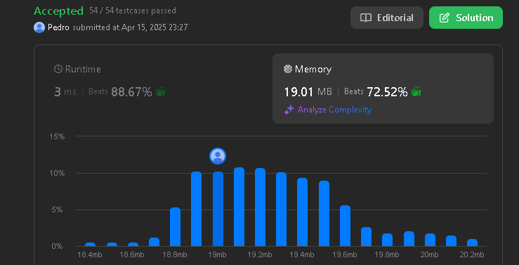
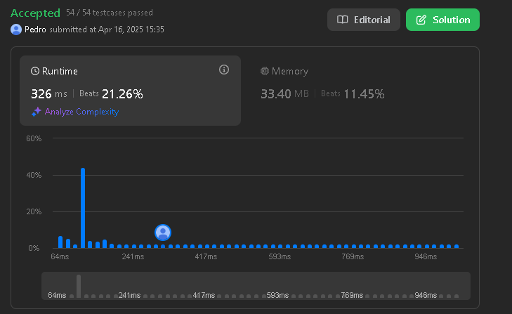
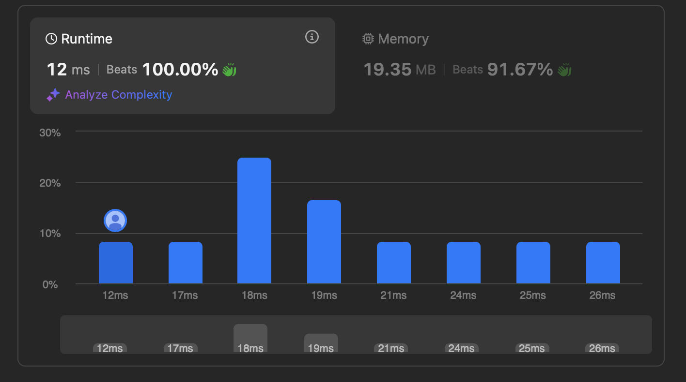
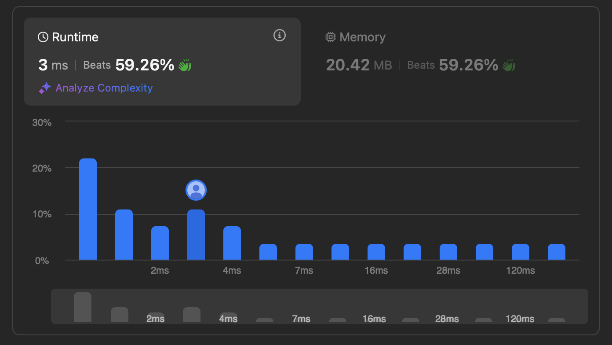

# LeetCodeQuest

**Conteúdo da Disciplina**: Grafos 1  

## Alunos
|Matrícula | Aluno |
| -- | -- |
| 20/0026151  |  Pedro Henrique F. Nunes |
| 18/0042041  |  Gustavo Barbosa de Oliveira |

## Sobre 
<!-- Descreva os objetivos do seu projeto e como ele funciona. -->

### Escolha da plataforma
Para este trabalho de Grafos 1, opitamos por utilizar um juiz eletrônico para resolver exercícios relacionados aos conceitos estudados em aula. Desta forma, escolhemos o LeetCode, pois oferece um vasto repositório de problemas de programação com níveis variados de dificuldade, cobrindo vários tópicos fundamentais em estruturas de dados e algoritmos, incluindo grafos. A plataforma possui um sistema automático de avaliação que testa as submissões contra múltiplos casos de teste. 

### Exercícios escolhidos

Conforme mencionado acima, esse projeto visa contemplar a resolução de alguns exercícios sobre os conteúdos vistos em Grafos 1. Foram definidas 4 questões a serem resolvidas, sendo duas deles de nível médio e duas de nível difícil. Abaixo podemos identificar as questões que foram resolvidas dentro do juiz eletrônico LeetCode:

| Questão | Nome                                                                                 | Dificuldade |
|---------|--------------------------------------------------------------------------------------|-------------|
| 207     | [Course Schedule](https://leetcode.com/problems/course-schedule/description/)        | Média       |
| 847     | [Shortest Path Visiting All Nodes](https://leetcode.com/problems/shortest-path-visiting-all-nodes/description/)        | Difícil       |
| 2360     | [Longest Cycle in a Graph](https://leetcode.com/problems/longest-cycle-in-a-graph/description/)        | Difícil       |
| 797     | [All Paths From Source to Target](https://leetcode.com/problems/all-paths-from-source-to-target/description/)        | Média      |

### Link para o vídeo de apresentação
https://drive.google.com/file/d/1YWS9Wmpw0_inF_CcoNwUwpYmmW48uPtp/view?usp=share_link

## Screenshots

Segue abaixo Screenshots demonstrando que as soluções para os respectivos problemas foram aceitas em todos os testes de caso:

*Questão 207 - Course Schedule*

*Questão 847 - Shortest Path Visiting All Nodes*

*Questão 2360 - Longest Cycle in a Graph*

*Questão 797 - All Paths From Source to Target*

## Instalação 
**Linguagem**: Python, C  
<!-- Descreva os pré-requisitos para rodar o seu projeto e os comandos necessários -->

### Uso 
<!-- Explique como usar seu projeto caso haja algum passo a passo após o comando de execução. -->
A seguir, é explicado como qualquer pessoa pode copiar e testar os códigos presente neste repositório diretamente no LeetCode:

- *Acesse o site do LeetCode*:
Para acessar a questão no LeetCode, vá para o site por qualquer um dos links na tabela Sobre. Para executar os testes de caso e identificar se a solução foi aceita, será necessário se cadastrar ou fazer login.

- *Copie o código do repositório*:
Acesse a pasta Grafos deste repositório, clique no número do exercício e copie o código referente à questão desejada.

- *Cole o código no editor do LeetCode*:
No ambiente da questão, selecione a linguagem correta do código que foi utilizado para resolver a questão(por exemplo, Python ou C) e cole o código no editor online.

- *Execute e submeta*:
Clique em “Run” para testar com os casos de exemplo ou em “Submit” para rodar todos os casos de teste oficiais do LeetCode.
